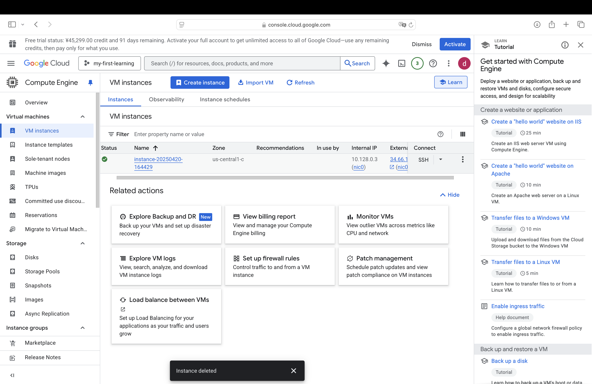
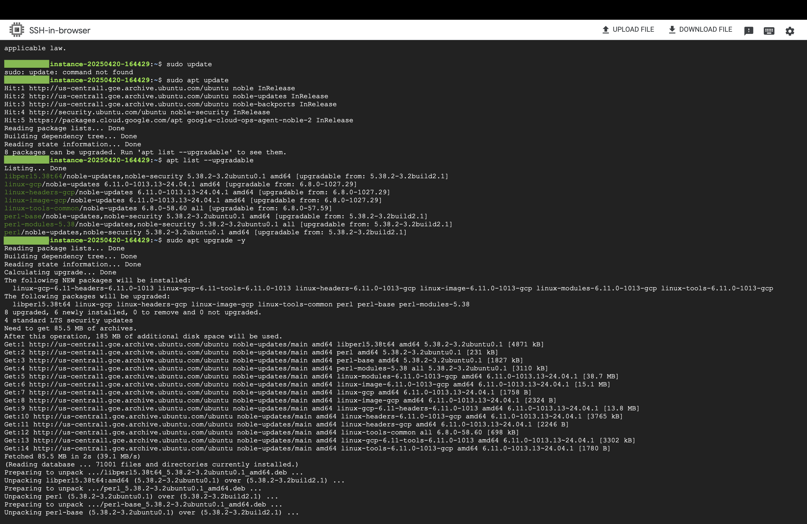
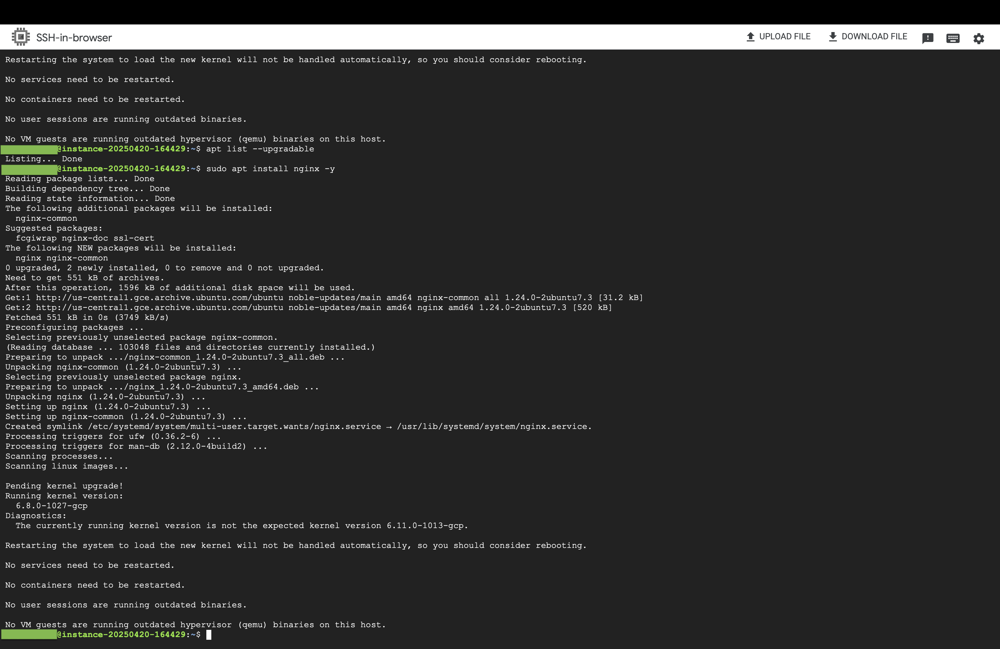
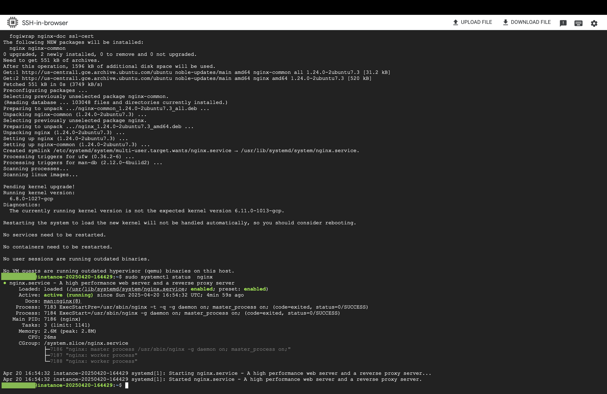
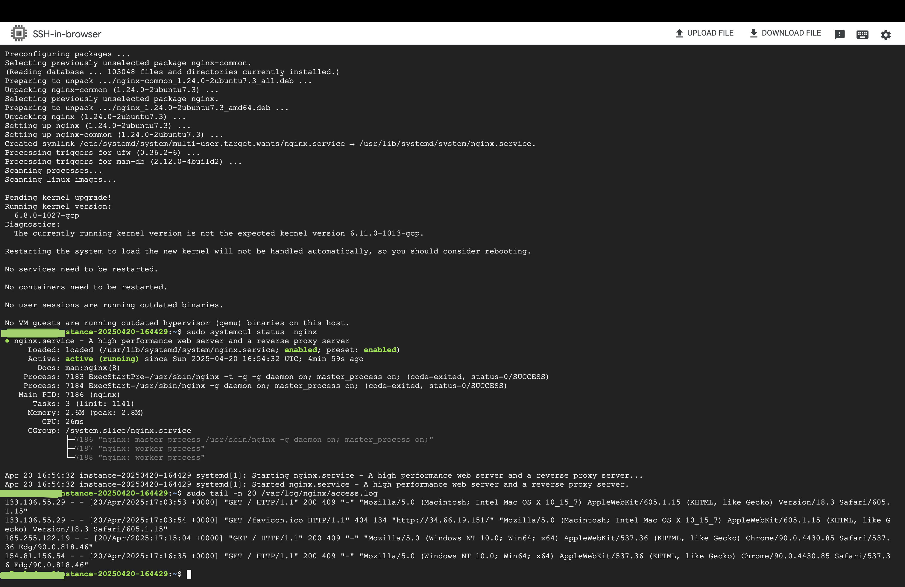
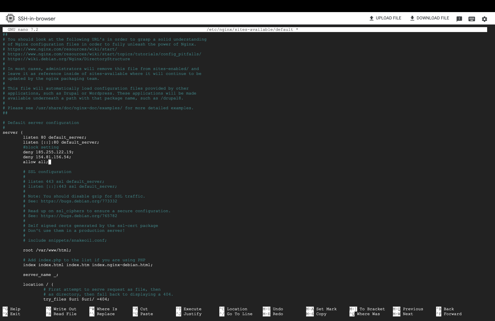
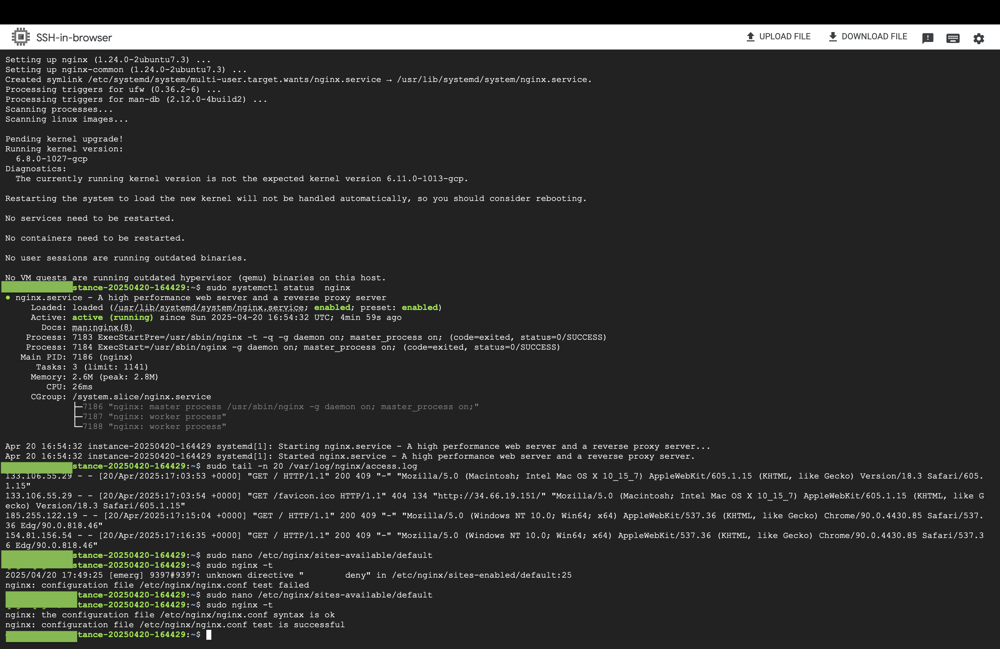
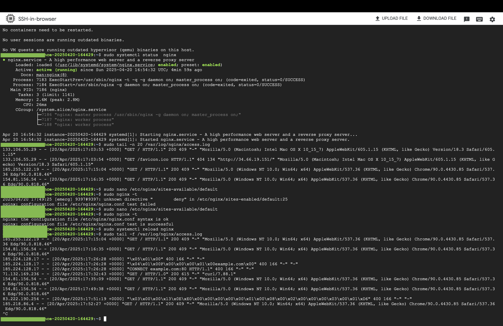

# GCP nginx Web Server with IP Blocking

This project demonstrates how I used Google Cloud Platform (GCP) to create a virtual machine (VM), set up an nginx web server, and apply basic IP-based access restrictions.

---

## Tech Stack

- GCP Compute Engine
- Ubuntu 20.04
- nginx
- SSH via browser
- CLI tools: `apt`,`nano`,`systemctl`,`tail`

---

## Setup Procedure

### 01. VM Instance Creation
GCP console screenshot after VM setup.


---

### 02. System Update
```bash
sudo apt update
apt list --upgradable
sudo apt update -y
```


---

### 03. nginx Installation
```bash
sudo apt install nginx -y
```


---

### 04. Check nginx Status
```bash
sudo systemctl status nginx
```


---

### 05. Access Default nginx Page!
[nginx Welcome Page](./screenshots/05_nginx_accessed.png)

---

### 06. View Access Logs
```bash
sudo tail -n 20 /var/log/nginx/access.log
```


---

### 07. Block Suspicious IPs in nginx
```nginx
deny 185.255.122.19;
deny 154.81.156.54;
allow all;
```
Configuration done in:  
`/etc/nginx/sites-available/default`



---

### 08. Test & Reload nginx Config
```bash
sudo nginx -t
sudo systemctl reload nginx
```


---

### 09. Monitor Logs (403 Confirmed)
```bash
sudo tail -f /var/log/nginx/access.log
```


---

## What I Learned

Through this project, I didn’t just complete tasks—I questioned, investigated, and reflected on how things work under the hood. Here’s what I gained:

### 1. Cloud & Linux Fundamentals
- How to deploy a VM on GCP using Compute Engine
- The difference between `apt update` and `apt upgrade`, and why both matter
- How to manage Linux services using `systemctl`
- Where nginx stores its configuration, and how to safely test and reload settings

### 2. Web Server Behavior & Log Analysis
- How to install and verify nginx on a fresh server
- What happens when a browser accesses a web server (e.g., automatic requests like `/favicon.ico`)
- How to read `access.log` and interpret request methods, status codes, and user agents
- When to use `tail -n` for quick inspection and `tail -f` for live monitoring

### 3. Practical Security Awareness
- How to detect unusual traffic patterns and bot behavior
- How to block malicious IP addresses with nginx
- The basics of hardening a public-facing Linux server

### 4. Technical Documentation
- How to document a project clearly using Markdown (including image embedding, code blocks, and folder structure)

---

This project wasn't just about running commands—it was about understanding why each step matters, and building the habit of asking, “What is this really doing?”

--

## Future Improvement

If I were to extend this project, I would add HTTPS support using Let's Encrypt and Certbot.  
It would allow encrypted communication and simulate a more realistic, production-ready web environment.

---

## Author

**Daiki Yoshimaru**  
Aspiring cloud/infrastructure engineer.  
Started with no professional experience — building skills through personal projects.  
Certifications: TOEIC 880, FE, CCNA, AWS CCP  
Languages: Japanese (Native), English (Intermediate – self-learned)

---

